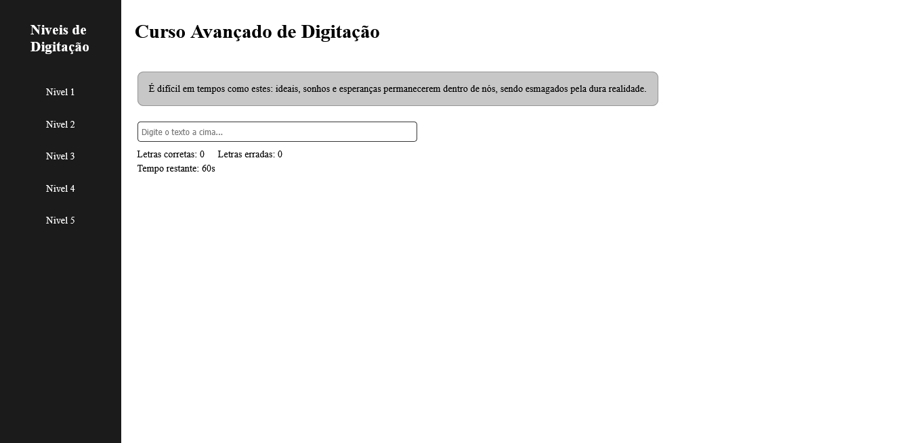

# typing course

This project is a typing practice website where users can improve their typing skills by completing given texts under a time limit. As soon as the user starts typing, a 60-second timer begins to count down. The application provides real-time feedback by highlighting correct letters in green and incorrect ones in red, helping users quickly identify mistakes. The platform includes five levels of increasing difficulty, from beginner-friendly texts to advanced challenges.

---

## ✨ Features

- Typing Practice – Type a displayed text within 60 seconds.

- Real-Time Feedback – Correct letters turn green, incorrect ones turn red instantly. Keeps track of hits and errors while typing.

- Difficulty Levels – Five levels available, from the easiest (Level 1) to the hardest (Level 5).

- Engaging Timer – Countdown begins as soon as you start typing.

---

## 🚀 Technologies

This project was developed with the following technologies:

- HTML
- CSS 
- JavaScript

---

## 📷 Screenshots

### Desktop


---

## 📦 How to use

1. Clone the repository:
```bash
git clone https://github.com/michaelprocha/alura-portfolio.git
```
2. Abra o arquivo `index.html` em qualquer navegador.

---

## 👨‍💻 Author

Made by [Michael Rocha](https://github.com/michaelprocha)

---

## 📄 License

This project is licensed under the MIT License. See the LICENSE file for more details.
